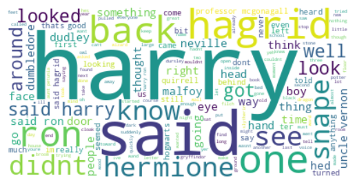

# NLP_Spelling_Correction

## Overview
This repository contains the code for the first homework assignment in the Natural Language Processing (NLP) course. The code processes Persian and English text data, performing various NLP tasks such as normalization, tokenization, stopword removal, and spelling correction.

## Table of Contents
- [Installation](#installation)
- [Libraries Used](#libraries-used)
- [Persian Data Processing](#persian-data-processing)
- [English Data Processing](#english-data-processing)
- [Spelling Error Correction](#spelling-error-correction)
- [Word Cloud Visualization](#word-cloud-visualization)
- [Usage](#usage)
- [Conclusion](#conclusion)

## Installation
To run the code, ensure you have the following libraries installed:

```bash
pip install hazm nltk wordcloud matplotlib
```

## Libraries Used
- **hazm**: A Python library for processing Persian text.
- **nltk**: The Natural Language Toolkit for English text processing.
- **WordCloud**: For generating word clouds from text data.
- **Matplotlib**: For visualizing data.

## Persian Data Processing
The Persian text is processed through the following steps:
1. **Read the file**: Load the Persian text file.
2. **Normalize**: Normalize the text using the `hazm` library.
3. **Tokenization**: Split the text into sentences and words.
4. **Remove punctuation and stopwords**: Clean the tokenized words.
5. **Lemmatization**: Reduce words to their base form.
6. **Save the result**: Write the cleaned text to a new file.

## English Data Processing
The English text undergoes similar processing:
1. **Read the file**: Load the English text file.
2. **Lowercase conversion**: Convert all text to lowercase.
3. **Tokenization**: Split the text into sentences and words.
4. **Remove numbers and URLs**: Clean the tokenized words.
5. **Remove stopwords**: Filter out common English stopwords.
6. **Generate word cloud**: Visualize the most frequent words.

## Spelling Error Correction
The code includes a function for correcting spelling errors using the Damerau-Levenshtein distance algorithm. It suggests corrections for misspelled words based on a provided vocabulary.

## Word Cloud Visualization
Here is a sample word cloud generated from the processed text:



## Usage
1. Place your Persian and English text files in the appropriate directory.
2. Run the script to process the text and generate outputs.
3. Check the output files for cleaned text and visualizations.

## Conclusion
This homework assignment demonstrates fundamental NLP techniques for processing both Persian and English text. The methods implemented can be extended for more complex NLP tasks in future projects.
